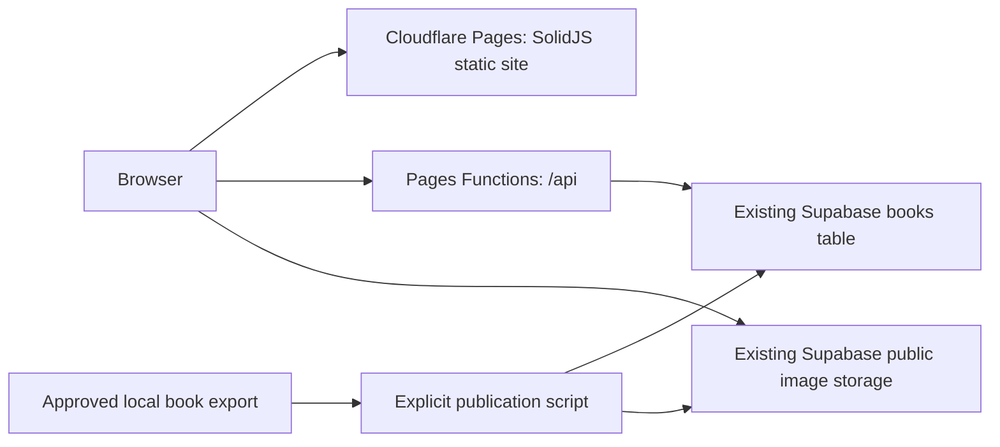

# Cloudflare deployment

## Saved status — 11 September 2026

Lewis has now authorised the push and initial Pages deployment. The public custom domain is still deliberately pending until the Cloudflare preview has been checked and the registrar DNS can be changed safely.

Completed: Pages API, same-origin frontend, compatible image paths, concurrent star increments, explicit approved-book importer, production build and local/hosted browser checks. No Express/Render process is needed by this website.

Remote actions already completed before that instruction:

- Authenticated Wrangler to the existing Cloudflare account and created the Direct Upload Pages project `onemorebook` (production branch `main`). The first production deployment is `185110ae-ee27-4158-8e44-6d9217c3b3cc`, commit `0a89a55`, at `https://185110ae.onemorebook.pages.dev`; the production alias is `https://onemorebook.pages.dev`. Existing `11x100` is a separate Workers application and was left unchanged.
- Uploaded only the server-side `SUPABASE_ANON_KEY` Pages secret. Its value is never in the repository or frontend bundle. No custom domain, zone, nameserver or DNS record has been changed.
- Imported **Milo and the Sun-Seeds** into the existing Supabase project as `21df2344-4b8e-5f14-b198-03ac4112f6e4`. All 13 uploaded images matched the human-approved export byte-for-byte before its row was marked complete. Existing books and star counts were preserved.

The reader is live at `https://onemorebook.pages.dev/book/21df2344-4b8e-5f14-b198-03ac4112f6e4` and locally at http://localhost:8788/book/21df2344-4b8e-5f14-b198-03ac4112f6e4 while `pnpm run dev:pages` is running. Local assisted export: `generation/output/books/book-assisted-20260910213535-1b28c7aec5/export/book.html`.

`https://onemorebook.ai/` still serves the previous Netlify deployment. Its previous Render API has not been replaced publicly. DNS is unchanged: apex A `75.2.60.5`, `www` CNAME `splendorous-flan-727529.netlify.app`, nameservers `ns41.domaincontrol.com` / `ns42.domaincontrol.com`. This is an observed web-record snapshot, not a complete DNS-zone backup.

## Architecture



`wrangler.jsonc` specifies the public Supabase project URL and bucket. `SUPABASE_ANON_KEY` is a runtime secret. Browser code contains no database credential. Requests use Supabase's HTTPS REST API; this workload needs neither a persistent Node server nor a direct PostgreSQL connection pool.

| Route | Behaviour |
| --- | --- |
| `GET /api/health` | Verifies the database is reachable |
| `GET /api/books` | Complete books; `limit`, `offset`, `sortBy=stars\|date`, `order=asc\|desc` |
| `GET /api/books/top` | Same listing, three books by default |
| `GET /api/books/:id` | Complete book with cover and page URLs |
| `PUT /api/books/:id/stars` | Adds one star; ignores client-supplied totals |

Votes use conditional updates and bounded retries to preserve competing increments. They retain the existing anonymous applause behaviour, rather than introducing user accounts or one-vote-per-person tracking. Supabase grants/RLS policies are unchanged; hiding the anon key in the Function does not itself revoke existing public database permissions.

`frontend/public/_routes.json` invokes Functions only for `/api/*`. Static pages/assets therefore use Pages static serving. Pages static requests are free and unlimited; Functions share the Workers Free allowance of 100,000 requests/day across the account. Supabase storage, database and egress remain subject to the existing Supabase plan. No paid Cloudflare features were enabled. [Cloudflare pricing](https://developers.cloudflare.com/pages/functions/pricing/).

## Local verification

From the repository root, with Node.js 22+:

```bash
pnpm install --frozen-lockfile
pnpm --dir frontend install --frozen-lockfile
pnpm run check:pages
pnpm run dev:pages
```

For a fresh machine, copy `.dev.vars.example` to `.dev.vars` and set its `SUPABASE_ANON_KEY` using the existing private Supabase settings. Do not overwrite a populated `.dev.vars`. That file is ignored by Git. The URL and bucket come from `wrangler.jsonc`.

The local API reads the real library. Clicking a star manually changes the real database. Automated API tests use mocked Supabase requests; saved browser checks intercept voting, so no real votes were changed during verification.

## Deploy later, when requested

These commands make remote changes. The first deployment and secret upload are complete; run them again only when publishing a new frontend/API revision.

1. If Netlify still auto-deploys this repository, pause its automatic publishing before pushing migration changes. Previous hosting files are archived under `docs/legacy-hosting/`; existing remote sites remain available for rollback.
2. Run `pnpm exec wrangler whoami` and confirm the intended Cloudflare account. Use `pnpm exec wrangler login` if authentication expired. Project `onemorebook` already exists; do not recreate it.
3. Set the project's secret, then deploy from the repository root:

```bash
pnpm exec wrangler pages secret put SUPABASE_ANON_KEY --project-name onemorebook < <(awk -F= '/^SUPABASE_ANON_KEY=/{print substr($0,index($0,"=")+1)}' .dev.vars)
pnpm run deploy:pages
```

The deployment command first runs local checks and builds. It uploads `frontend/dist` and the root `functions/` implementation; it does not upload `generation/`, local books or private settings as static assets. [Pages configuration](https://developers.cloudflare.com/pages/functions/wrangler-configuration/).

4. Verify `https://onemorebook.pages.dev/api/health`, the library, an existing book and `/book/21df2344-4b8e-5f14-b198-03ac4112f6e4`. Hosted health, library, book retrieval, image loading, page turning, mobile layout and security headers are already verified. A deliberate real vote is still a user-facing smoke test; the current Milo count is 1 and was preserved.
5. Connect the domain only after that preview works, following the next section.

This is a **Direct Upload** project: Git pushes alone do not deploy it. Wrangler is the deployment path; CI can run the same command later. Do not expect Netlify-style automatic deploys from the reserved project. Cloudflare cannot convert a Direct Upload project to Git integration; that would require a new project. CI can automate Wrangler deployments without changing the project type. [Direct Upload](https://developers.cloudflare.com/pages/get-started/direct-upload/).

## Domain switch later

For apex `onemorebook.ai`, add the domain as a zone in this Cloudflare account on the Free plan. Export/review the current full DNS zone first, including email/TXT records, and preserve those records during onboarding. Change the domain's nameservers at its registrar to the exact pair Cloudflare assigns; do not guess them.

Once active, open **Workers & Pages → onemorebook → Custom domains** and add `onemorebook.ai` and `www.onemorebook.ai`. Complete the Pages setup so Cloudflare creates the correct records and certificates. Merely pointing a CNAME at Pages is insufficient. Check both HTTPS hosts before retiring Netlify/Render. [Custom-domain instructions](https://developers.cloudflare.com/pages/configuration/custom-domains/).

No zone, nameserver, DNS-record, redirect or custom-domain changes have been made. Wrangler authentication currently includes Pages access and zone read access; DNS/registrar access needs the Cloudflare dashboard and 123-reg when this step is resumed.

## Publish another approved book

Publication is separate from site deployment and defaults to a local dry run:

```bash
pnpm run publish:book --export generation/output/books/BOOK_ID/export
```

Once the export is approved and ready to upload:

```bash
pnpm run publish:book --export generation/output/books/BOOK_ID/export --publish
```

The script reads `SUPABASE_URL`, `SUPABASE_ANON_KEY` and optional `SUPABASE_STORAGE_BUCKET` from the environment or private `backend/.env`. It validates approval hashes, creates a pending row, uploads originals without overwriting, verifies every public image, then marks the row complete. An interrupted upload stays hidden from the reader until resumed successfully. Rerunning the same export uses the same deterministic book ID; a revised export gets a different ID. Checkpoints are atomically saved under `.local/publications/`.

**Milo is already imported; do not republish it just to deploy the website.** Its export digest is `95a33e508031705b6ae5b66bd27091ad21482a8d636cea90ebc0581ee1c1b076`.

## Recovery and evidence

- `.local/cloudflare-migration-20260911/`: original app-source archive, approved export hashes, import log, build/API test logs and local browser screenshots/results.
- `.local/publications/21df2344-4b8e-5f14-b198-03ac4112f6e4/`: completed publication checkpoint and row payload.
- `generation/RESUME.md`: accepted-book handover and previous generation history.

These local records and original exports remain on disk across shutdowns and are excluded from source-control uploads. No inference or book approvals were performed during this migration.
