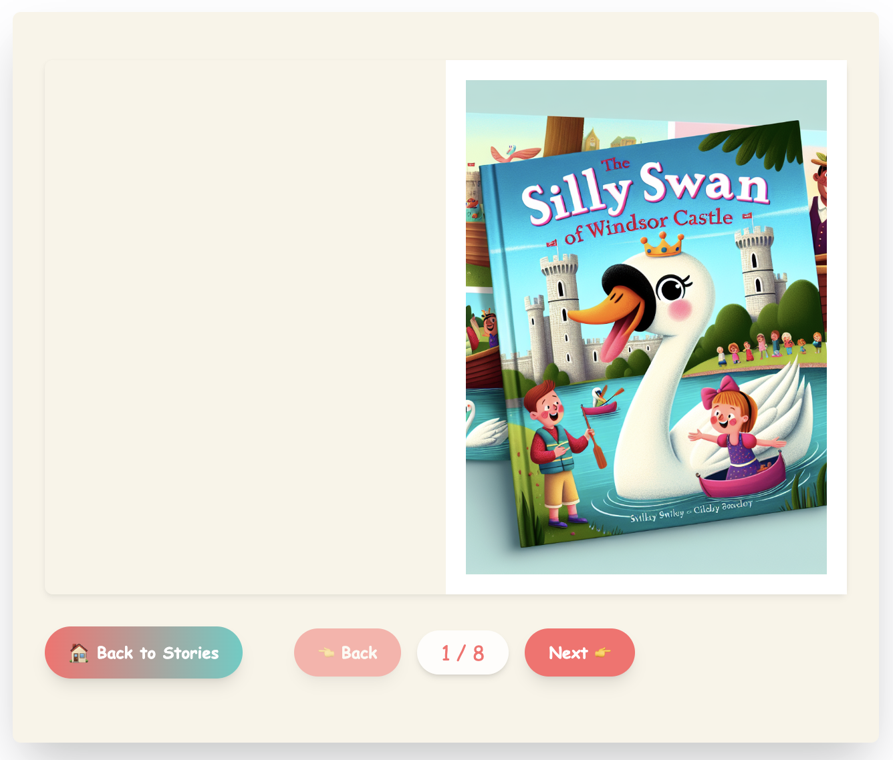
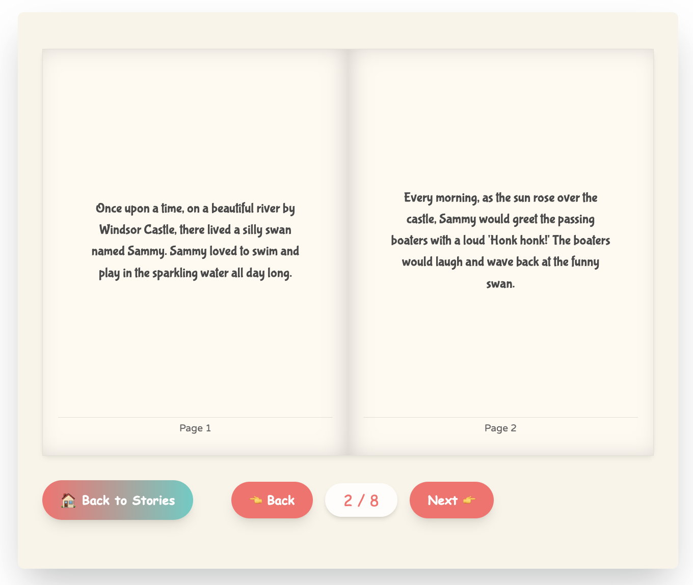

# OneMoreBook

A full-stack application for generating children's books using LLMs. This project combines both frontend and backend components in a monorepo structure.

### Homepage


### Book Content (mobile responsive)


### Book Content (desktop)




## Project Structure

* **`/backend`**: Supabase backend built with TypeScript
* **`/fontend`**: SolidJS frontend application with TailwindCSS

## Prerequisites

* Node.js (v18+)
* pnpm package manager
* Supabase account (for backend services)

## Getting Started

### Installation

1. Clone the repository
2. Install dependencies for both projects:

```bash
# Install backend dependencies
cd backend
pnpm install

# Install frontend dependencies
cd ../fontend
pnpm install
```

### Running the Development Environment

You can run both the frontend and backend servers concurrently using the following commands:

```bash
# Start the backend server
cd backend
pnpm run dev     # Runs on http://localhost:3000 by default

# In a separate terminal window
cd fontend
pnpm run dev     # Runs on http://localhost:5173 by default
```

### Building for Production

```bash
# Build the backend
cd backend
pnpm run build

# Build the frontend
cd ../fontend
pnpm run build
```

## Backend

The backend is built with:

* TypeScript
* Supabase for database, authentication, and file storage
* PostgreSQL for data storage
* LangChain for LLM integrations

### Backend Features

* API endpoints for generating children's books
* Supabase PostgreSQL for storing book content and metadata
* Supabase Storage for hosting book images
* Authentication and user management via Supabase

## Frontend

The frontend is built with:

* SolidJS
* TypeScript
* TailwindCSS for styling
* Responsive design for both mobile and desktop

### Frontend Features

* Interactive book creation interface
* Beautiful book reader with page flip animations
* Responsive layout for all devices

## Deployment

### Backend Deployment

The backend connects to Supabase services, which handle hosting and infrastructure:

```bash
cd backend
pnpm run build
# Deploy to your hosting service of choice
```

### Frontend Deployment

The frontend can be deployed to any static hosting service:

```bash
cd fontend
pnpm run build
# Deploy the contents of the dist folder
```
